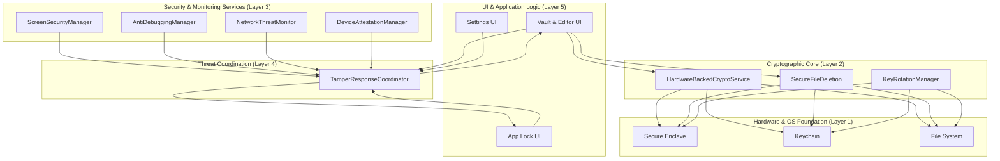
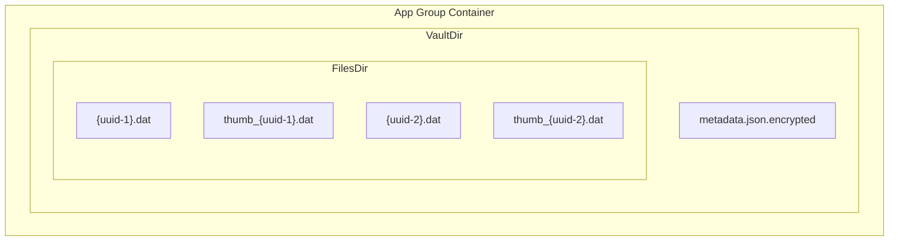
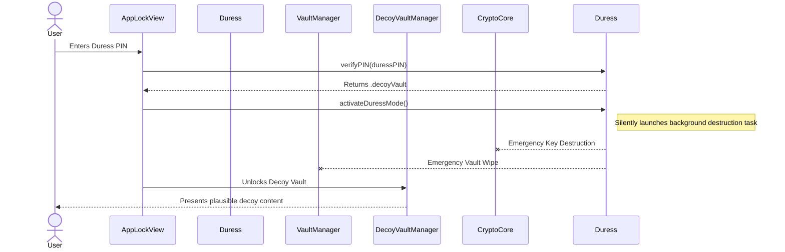
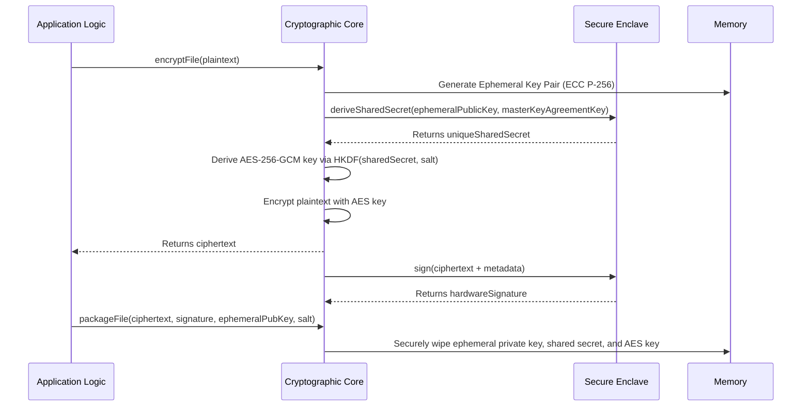
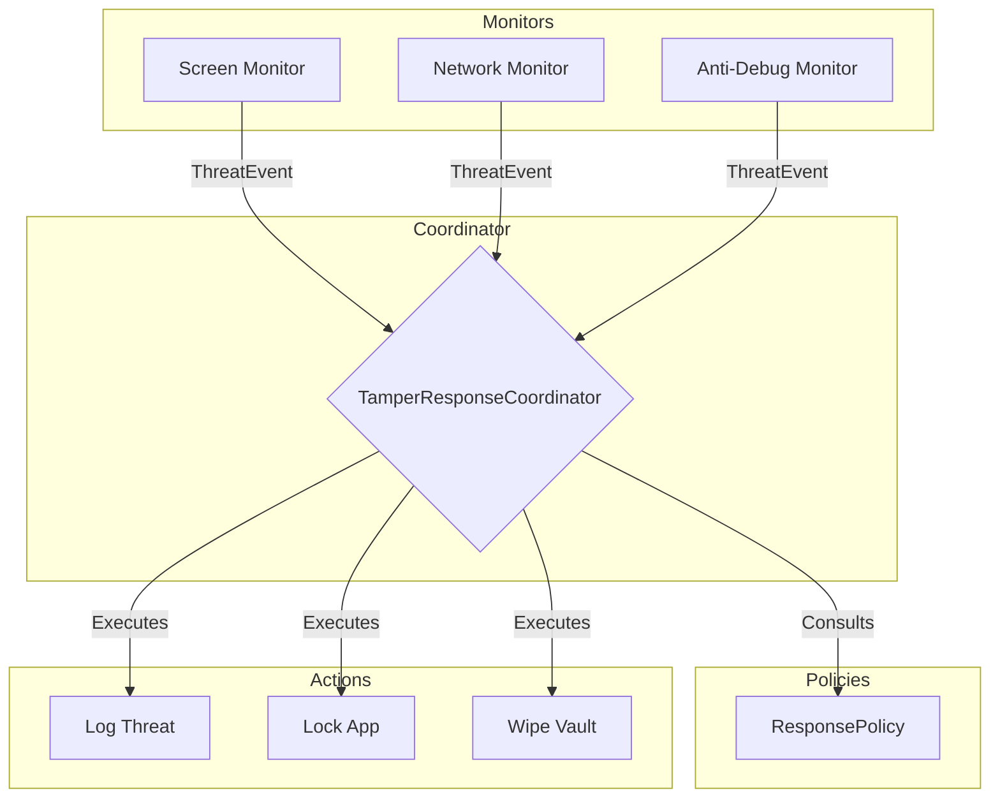
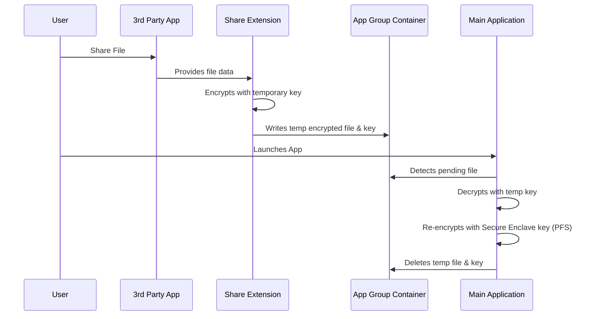

### **UltraLocked: A Whitepaper on Hardware-Anchored, Ephemeral Security for iOS**

**Version:** 1.0
**Date:** July 28, 2025

---

### **1.0 Executive Summary**

UltraLocked is a secure file vault for iOS, engineered from a zero-trust, offline-first philosophy. It provides military-grade privacy and plausible deniability by anchoring all cryptographic operations in the device's Secure Enclave. This hardware-level root of trust ensures that encryption keys are non-extractable, offering a degree of security that is physically impossible for software-only solutions to achieve.

This document details the technical architecture of UltraLocked, which is founded on three core principles:

1.  **Hardware-Anchored Cryptography:** All cryptographic operations are bound to the device's Secure Enclave, making secret key material inaccessible to the main processor, the operating system, or the application itself.
2.  **Per-File Perfect Forward Secrecy (PFS):** Every file is treated as a distinct cryptographic entity, encrypted with a unique, single-use key. The compromise of one file's key has no cryptographic impact on any other file in the vault.
3.  **Robust Emergency Failsafe Systems:** Advanced protocols, including a Duress Code system that activates a decoy vault while silently destroying the real one, provide users with powerful tools for plausible deniability and data protection under coercion.

By transparently outlining our threat models and security mechanisms, this paper aims to demonstrate that UltraLocked provides a new standard of personal data sovereignty and forensic resilience on a mobile platform.

---

### **2.0 Introduction: The Need for a New Security Paradigm**

#### **2.1 Limitations of Conventional Security Models**

The landscape of digital security is dominated by two primary models, both of which possess inherent limitations for users with extreme security needs:

*   **Cloud-Based "Zero-Knowledge" Services:** While these services prevent the provider from reading user data, they still require fundamental trust in the provider's infrastructure, implementation, and legal jurisdiction. They are vulnerable to server-side compromise, sophisticated metadata analysis, and compelled disclosure through legal channels. The user's data, though encrypted, resides on third-party hardware beyond their control.

*   **Standard On-Device Encryption:** Traditional secure storage apps often rely on a single master password or key to encrypt the entire vault. This creates a single point of failure; if the key is compromised, the entire dataset is vulnerable. Furthermore, these applications often fail to provide sufficient forensic resilience, leaving recoverable data fragments on disk, and offer no plausible deniability against coerced access.

#### **2.2 The UltraLocked Solution: A Hardware-Anchored, Ephemeral Approach**

UltraLocked was conceived to address these architectural limitations. It operates on the principle that the only truly trustworthy component is the user's own hardware. Our solution is built on three strategic shifts:

1.  **Shifting the Root of Trust:** We move the root of trust from a software-based password or a third-party server to the physically isolated Secure Enclave co-processor integrated into Apple's silicon.
2.  **Implementing an Ephemeral Keying System:** We abandon the single master key model in favor of a per-file cryptographic system. This granular approach dramatically minimizes the impact of any potential, however unlikely, cryptographic break.
3.  **Empowering the User with Failsafes:** We provide users with pre-configured, powerful tools for plausible deniability and data destruction, recognizing that the threat of physical coercion is a critical component of a comprehensive security model.

### **3.0 Core Principles & Design Philosophy**

The architecture of UltraLocked is not a collection of disparate features but a cohesive system built upon a set of immutable principles. These principles govern every design decision, from the lowest-level cryptographic operations to the highest-level user interface, ensuring a consistent and uncompromising security posture.

#### **3.1 Hardware as the Root of Trust**

All security guarantees in UltraLocked derive from the physical hardware of the user's device, specifically the Secure Enclave co-processor. We treat the main operating system and even the application itself as potentially untrustworthy environments. Secret key material, such as the master keys used for deriving file encryption keys, is generated within and confined to the Secure Enclave. This key material is non-extractable; it cannot be read, copied, or exfiltrated by any software running on the main application processor, including a compromised OS kernel. All sensitive cryptographic operations, such as signing and key agreement, are delegated to the Secure Enclave, which performs them in its isolated memory space and returns only the result. This design ensures that the ultimate security of the user's vault is anchored in the physical integrity of their device's silicon.

#### **3.2 Zero-Knowledge & Zero-Infrastructure**

UltraLocked is engineered to operate 100% offline. The application contains no networking code for communicating with developer-controlled servers. This architectural choice eliminates entire classes of vulnerabilities by design:
*   There are no remote servers to attack.
*   There is no user data, metadata, or analytics to be breached or subpoenaed.
*   There is no user account system to compromise.

We, the developers, have no knowledge of our users or their data. The user is the sole custodian of their information. This model provides the strongest possible guarantee of privacy, as there is simply no infrastructure to trust or attack.

#### **3.3 Ephemeral by Default**

Data persistence is treated as a liability. To minimize the forensic footprint, cryptographic materials are designed to be ephemeral. For each file encryption or decryption operation, a unique, single-use key is derived through a hardware-backed process. This key exists only in volatile memory for the brief moment it is needed and is securely wiped immediately after the operation is complete. It is never written to persistent storage. This principle extends to the data itself through user-configurable self-destruct timers (Time-To-Live), ensuring files do not outlive their intended lifespan.

#### **3.4 Plausible Deniability**

A core tenet of the UltraLocked design is to provide the user with a credible means of denying the existence of their primary vault when under duress. This is more than just hiding data; it is about providing a functional, convincing alternative that can satisfy an adversary's demands. The Duress Code system is the primary mechanism for this, activating a separate, pre-populated decoy vault. The activation of this decoy vault serves as a silent trigger for the cryptographic destruction of the real vault's keys, protecting the user by making the authentic data permanently irrecoverable.

#### **3.5 Defense-in-Depth**

UltraLocked's security is not reliant on a single mechanism. Instead, it employs multiple, independent layers of protection to create a resilient system with no single point of failure. These layers include:
1.  **Hardware:** The physical isolation of the Secure Enclave.
2.  **Operating System:** The security features of the iOS sandbox.
3.  **Cryptography:** The per-file Perfect Forward Secrecy model.
4.  **Application Logic:** Continuous, real-time threat monitoring for signs of environmental compromise.
5.  **User-Defined Protocols:** Configurable failsafes like the Dead Man's Switch and Emergency Triggers.

A failure or bypass of one layer is intended to be caught or mitigated by another, ensuring that the integrity of the user's vault is maintained even under adverse conditions.

### **4.0 System Architecture**

The UltraLocked architecture is a multi-layered, defense-in-depth model designed for compartmentalization and resilience. Each layer operates with a minimum of trust in the layers above it, with the hardware serving as the ultimate root of trust. This design ensures that a compromise at a higher level, such as the application UI, does not automatically compromise the lower-level cryptographic core.

#### **4.1 Architectural Overview**

The system is conceptually divided into five distinct layers, each with a specific responsibility:

*   **Layer 1: Hardware & OS Foundation:** This is the immutable base upon which all security is built. It consists of the iOS Sandboxed Environment, the system Keychain for storing key references, and, most critically, the Secure Enclave for all cryptographic operations.
*   **Layer 2: Cryptographic Core:** A dedicated, isolated set of services responsible for all encryption, decryption, and key management. It is the sole component that interfaces directly with the Secure Enclave for cryptographic tasks, acting as a gatekeeper for hardware-backed security.
*   **Layer 3: Security & Monitoring Services:** A suite of independent, parallel monitors that continuously assess the device's state for signs of tampering or compromise. These services monitor screen activity, clipboard state, network connections, device integrity, and debugger attachment.
*   **Layer 4: Centralized Threat Coordination:** This layer acts as the system's security nerve center. It receives threat events from the monitoring services, assesses the cumulative risk, and executes a proportional response based on a pre-defined security policy.
*   **Layer 5: Vault & Application Logic:** The user-facing components that manage files, settings, and interactions. This layer operates on a zero-trust basis, treating all underlying data as hostile until it has been authenticated and securely decrypted by the lower layers.

The interaction between these layers is strictly controlled to maintain compartmentalization, as illustrated below.

#### **4.2 The Secure Data Model**

All user data is stored within the application's sandboxed App Group container, which allows for secure, high-speed data sharing between the main application and its Share Extension. The on-disk structure is designed to reveal minimal information.

*   **Encrypted File Wrapper:** Individual files are not stored as raw encrypted blobs. Instead, they are encapsulated within a structured `EncryptedFileWrapper` object. This wrapper contains the encrypted file content (ciphertext), the unique ephemeral public key used for that specific encryption session, a cryptographic salt used in key derivation, and a hardware-backed digital signature (ECDSA) that authenticates the integrity of the entire wrapper. This structure is critical for enabling Perfect Forward Secrecy.
*   **Encrypted Metadata Database:** The list of vault items, including their creation dates, display names, and TTL settings, is stored in a single metadata file. This file contains no sensitive content or plaintext filenames. The entire metadata file is itself encrypted using the same hardware-backed cryptographic core, ensuring that the vault's structure and contents are unintelligible without proper authentication.

The resulting file system layout is simple and forensically opaque:

You've found an excellent and subtle point. My apologies! The GitHub Mermaid renderer is more strict than many other parsers, and it correctly identified a syntax error in the diagram I generated.

The error message `Expecting '+', '-', 'ACTOR', got 'INVALID'` is Mermaid's way of saying it encountered text formatting (`**...**`) and characters (`!`) where it expected plain message text.

Here is the corrected Mermaid diagram for the **Duress Code Activation Flow**, along with a full, corrected version of Section 5. The changes are:

1.  **Simplified Message Text:** I've removed the `**` bolding and `!` characters from the arrow message text. GitHub's renderer requires this to be plain text.
2.  **Corrected Arrow Syntax:** I've changed the arrow to `--x`. In Mermaid, this represents a dashed line with a cross at the end, which is the standard way to represent a lost or asynchronous message without a reply—perfect for a "fire-and-forget" background destruction task.

### Corrected Diagram

### **5.0 Core Security Mechanisms: A Technical Deep Dive**

This section provides a detailed examination of the key features that form UltraLocked's security posture. Each mechanism is designed to address specific, high-stakes threats and work in concert to create a resilient security system.

#### **5.1 Cryptographic Core & Perfect Forward Secrecy (PFS)**

*   **Benefit (For the Layperson):** Every file you save is locked in its own unique safe with a key that is created on the spot and destroyed immediately after use. Even if an attacker could somehow break open one safe, the keys and tools they find would be useless for opening any other safe in your vault.

*   **Technical Implementation:** UltraLocked's cryptographic engine is designed to ensure that the compromise of any single file—or even a long-term master key—does not compromise the security of other files. This is achieved through a per-file ephemeral keying system anchored in the Secure Enclave.

    The process for encrypting each file is as follows:
    1.  **Ephemeral Key Generation:** An ephemeral P-256 Elliptic-Curve key pair (a temporary public and private key) is generated in volatile memory.
    2.  **Key Agreement:** The ephemeral public key is combined with the app's non-extractable master key agreement key (which resides permanently in the Secure Enclave) using the Elliptic-Curve Diffie-Hellman (ECDH) key agreement algorithm. This operation is performed *inside* the Secure Enclave.
    3.  **Key Derivation:** The resulting shared secret from the ECDH operation is used as input for a Key Derivation Function (HKDF) based on SHA-256. A cryptographically random salt is added to derive a unique and single-use 256-bit AES-GCM key.
    4.  **Authenticated Encryption:** The file's plaintext is encrypted using the derived AES-256-GCM key. This algorithm provides both confidentiality (encryption) and authenticity (protection against tampering).
    5.  **Signing & Packaging:** The resulting ciphertext, along with the ephemeral public key and the salt, is signed by the app's master signing key (also in the Secure Enclave). This package becomes the `EncryptedFileWrapper` stored on disk.
    6.  **Secure Cleanup:** All sensitive key material generated during this process (the ephemeral private key, the shared secret, and the final AES key) is securely wiped from memory (`memset_s`) and never written to persistent storage.

#### **5.2 Plausible Deniability: The Duress Code System**

*   **Benefit (For the Layperson):** If you are forced to unlock your vault, you can enter a secret "duress" PIN instead of your real one. This will open a fake, but completely believable, decoy vault. In the background, without any visible indication, your real vault and all its contents are silently and permanently erased.

*   **Technical Implementation:** The Duress Code system relies on two separate PINs stored as distinct, biometrically-protected entries in the Keychain.
    1.  **PIN Verification:** When a user enters a PIN, the system first checks it against the main PIN. If it fails, it then checks against the duress PIN.
    2.  **Duress Mode Activation:** If the duress PIN is verified, the application immediately enters a persistent "duress mode." A flag is set in `UserDefaults`.
    3.  **Decoy Vault Presentation:** The application proceeds to unlock, but instead of loading the user's real vault, the `VaultManager` loads a pre-generated, plausible set of decoy files. The UI gives no indication that anything is unusual.
    4.  **Silent Destruction Trigger:** The successful validation of the duress PIN simultaneously triggers a detached, low-priority background task. This task initiates the irretrievable, cryptographic destruction of the real vault. It does so by instructing the `HardwareBackedCryptoService` and `SecureEnclaveManager` to perform an emergency wipe of all master keys and then securely deletes all files associated with the primary vault using multiple overwrite passes via the `SecureFileDeletion` service. This process is designed to be silent and complete even if the app is terminated.

#### **5.3 Ephemeral Data & Automated Failsafes**

*   **Benefit:** Ensures data does not persist beyond its intended lifespan or in situations where you are unable to access your device for an extended period, such as loss or incapacitation.
*   **Technical Implementation:**
    *   **Self-Destruct Timers (TTL):** Each `VaultItem` in the metadata database can have an optional TTL value (in seconds). Upon every app launch and periodically while running, the `VaultManager` scans the metadata, identifies items where `creationDate + ttlSeconds` is in the past, and queues them for secure deletion.
    *   **The Dead Man's Switch:** This is a system-wide timer configured by the user (e.g., 7 days, 30 days). An authenticated "check-in" resets the timer. If the app is launched and the timer has expired, it immediately triggers the emergency vault wipe protocol, providing a failsafe against long-term device unavailability.

#### **5.4 Real-Time Threat Intelligence & Response**

*   **Benefit:** The app acts like a security guard, constantly watching for suspicious activity on your device. If it sees something like screen recording or a potential network attack, it can automatically lock down your vault to protect it.
*   **Technical Implementation:** The `TamperResponseCoordinator` is the central hub for all security-related events.
    1.  **Event Subscription:** It subscribes to publishers and delegates from all monitoring services (`ScreenSecurityManager`, `NetworkThreatMonitor`, `AntiDebuggingManager`, etc.).
    2.  **Threat Reporting:** When a monitor detects an anomaly (e.g., `screenRecordingStarted`), it creates a `ThreatEvent` object detailing the threat type, severity, and source, and reports it to the coordinator.
    3.  **Policy-Based Response:** The coordinator consults the currently active `ResponsePolicy` (e.g., Conservative, Balanced, Aggressive) to determine the appropriate `ResponseAction` for the given threat.
    4.  **Action Execution:** The coordinator executes the action, which can range from simply logging the event to calling the `VaultManager` to lock or wipe the vault, or instructing the UI to present the lock screen.

#### **5.5 Secure Productivity Features**

*   **Benefit:** Allows users to create and manage sensitive content without it ever touching insecure parts of the operating system, such as the public camera roll, general clipboard, or temporary file directories.
*   **Technical Implementation:**
    *   **Secure Camera:** The `SecureCameraView` uses `AVFoundation` to manage a direct-to-memory capture session. The captured image or video data is held in a private buffer and immediately passed to the `HardwareBackedCryptoService` for encryption before being written to the vault. The data never touches the standard photo library.
    *   **Secure Rich Text Editor:** The `RichTextEditorView` works with an `EncryptedMarkdownDocument` model. Text is held in memory as an `NSAttributedString`. On save, the attributed string is converted to RTF data, encrypted, and written directly to the vault.
    *   **Secure Share Extension:** When a file is shared to UltraLocked, the `ShareViewController` immediately encrypts the incoming data with a *temporary AES-GCM key* and saves the encrypted data and key material to the shared App Group container. Upon the next launch of the main app, the `VaultManager` detects these pending files, decrypts them using the temporary key, and then re-encrypts them using the proper hardware-backed PFS flow before deleting the temporary files. This ensures data is never stored unencrypted, even for a moment.

### **6.0 Threat Modeling & Mitigations**

The security architecture of UltraLocked is purpose-built to counter a range of modern digital and physical threats. This section outlines the primary threat vectors considered during development and the specific architectural features designed to mitigate them.

| Threat Vector | Description | Primary Mitigation(s) |
| :--- | :--- | :--- |
| **Coercive Access** | An attacker physically forces the user to unlock their device and the app ("Five-Dollar Wrench Attack"). The goal is to gain access to the real, sensitive data. | **Duress Code System:** The primary defense. Entering the duress PIN reveals a plausible decoy vault while silently triggering the cryptographic destruction of the real vault, protecting the user by making the authentic data permanently irrecoverable.    **Emergency Triggers:** Secondary failsafes like rapid device shaking or voice commands allow for quick activation of emergency protocols without needing to interact with the screen. |
| **Device Seizure & Forensic Analysis** | The user's device is confiscated and subjected to advanced offline analysis to recover data, keys, or user activity. | **Hardware-Anchored Keys:** Master keys are confined to the Secure Enclave and are non-extractable, preventing them from being recovered even with low-level access to the device's flash storage.    **Per-File PFS:** Since each file uses a unique key, forensic recovery would require a separate, computationally intensive attack for every single file.    **Secure Memory Management:** Prevents sensitive key material from being written to swap files on disk and disables core dumps, minimizing the forensic data available for cold boot or memory dump attacks.    **Secure File Deletion:** Uses multi-pass overwrites to sanitize storage blocks before a file is deleted, making data recovery significantly more difficult than a standard file system unlink. |
| **Malicious Software / Malware** | A malicious application or profile on the device attempts to escalate privileges to access UltraLocked's sandboxed data or keychain entries. | **iOS App Sandboxing:** The fundamental OS-level protection that isolates the app's data container.    **Device Attestation:** Actively checks for signs of a compromised environment (e.g., jailbreak), which is often a prerequisite for cross-app malware. If detected, security policies can be enforced to lock or wipe the vault. |
| **Shoulder Surfing / Screen Capture** | An observer or a malicious process (e.g., spyware) views or records the screen to capture sensitive information or the user's PIN. | **Screen Security Monitor:** Detects active screen recording or mirroring (e.g., AirPlay) and automatically applies a privacy overlay to obscure all content.    **Anti-Debugging:** Prevents attackers from attaching debuggers, which are a common tool for runtime analysis and screen inspection. |
| **Network-Based Attacks (MITM)** | An attacker on a hostile network (e.g., public Wi-Fi) attempts to intercept or manipulate traffic, primarily to attack potential future features or OS-level services. | **Network Threat Monitor:** Although the app is offline-first, this monitor provides a layer of defense by detecting insecure Wi-Fi, suspicious proxies, and potential SSL/TLS interception, which could be used in more advanced, chained attacks. It can trigger alerts or lock the vault if a high-risk network is detected. |
| **Application Tampering** | The app's binary is modified (e.g., repackaged with malicious code) to bypass security checks and exfiltrate data. | **Device Attestation:** Performs code integrity and bundle signature checks on launch. If the application's signature does not match the officially signed version, it indicates tampering, and the app will refuse to run or will immediately wipe the vault. |
| **User Incapacitation** | The user loses their device, is incapacitated, or is otherwise unable to access it for an extended period, risking eventual compromise. | **Dead Man's Switch:** Acts as an ultimate failsafe, automatically and securely wiping the entire vault if the user does not perform an authenticated "check-in" within a pre-configured time window.    **Self-Destruct Timers (TTL):** Ensures that individual files with a limited lifespan are automatically and securely deleted, minimizing the window of exposure for time-sensitive data. |

---

### **7.0 Privacy Posture**

UltraLocked's commitment to user privacy is absolute and is reflected in its core architectural design.

7.1.  **No Data Collection:** The application collects no analytics, no diagnostics, and no user data of any kind. There is no code included for tracking user behavior, session length, or feature usage.

7.2.  **Offline by Design:** The app contains no networking code for communicating with a central or third-party server. This eliminates any possibility of remote data exfiltration, metadata collection, or server-side logging. All operations, including security checks and cryptographic functions, are performed entirely on-device.

7.3.  **Metadata Sanitization:** To protect user anonymity, UltraLocked automatically strips potentially identifying metadata (e.g., EXIF GPS coordinates, camera model information) from media files upon import into the vault. The goal is to store only the essential content, divorced from its potentially revealing context.

---

### **8.0 Conclusion**

UltraLocked represents a significant step forward in personal data security on mobile devices. By moving the root of trust to the hardware and designing for failure, it provides a resilient and trustworthy environment for sensitive information. Its architecture is built not just to protect data from unauthorized access, but to provide the user with credible tools for plausible deniability and forensic resilience in the most challenging of circumstances. We believe this transparent, user-controlled model is the future of personal privacy.

---

### **Appendix**

#### **A.1 Glossary of Terms**

*   **Secure Enclave:** A dedicated, hardware-based security co-processor in Apple's chips that is isolated from the main processor. It handles cryptographic operations and ensures that secret key material is never exposed to the operating system.
*   **Perfect Forward Secrecy (PFS):** An encryption property ensuring that if a long-term key is compromised, past session keys (and thus past encrypted data) are not compromised. In UltraLocked's context, it refers to the per-file ephemeral keying system.
*   **AES-265-GCM:** Advanced Encryption Standard with a 256-bit key in Galois/Counter Mode. A modern, authenticated encryption algorithm that provides both confidentiality and integrity.
*   **ECDH (Elliptic-Curve Diffie-Hellman):** A key agreement protocol that allows two parties, each having an elliptic-curve public-private key pair, to establish a shared secret over an insecure channel.
*   **HKDF (HMAC-based Key Derivation Function):** A function that takes a potentially weak secret and a salt and produces a stronger, cryptographically secure key.
*   **Plausible Deniability:** The ability for a user to credibly deny the existence of a piece of information. In UltraLocked, this is achieved via the Duress Code and decoy vault.
*   **Forensic Resilience:** The ability of a system to resist forensic analysis and data recovery efforts after data has been deleted.

#### **A.2 Cryptographic Standards References**

*   **Apple Platform Security Guide:** [https://support.apple.com/guide/security/welcome/web](https://support.apple.com/guide/security/welcome/web)
*   **NIST Special Publication 800-38D:** Recommendation for Block Cipher Modes of Operation: Galois/Counter Mode (GCM) and GMAC.
*   **RFC 5869:** HMAC-based Extract-and-Expand Key Derivation Function (HKDF).